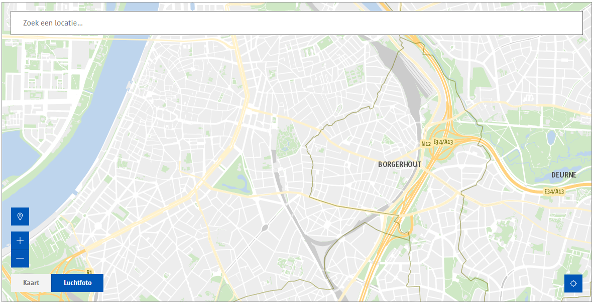

# NgxLocationPicker

Location Picker for Angular 7+. Provides easy to use interface for searching locations or addresses within the city of Antwerp. For projects that are still using Angular 5, we are [maintaining a v1 branch](https://github.com/digipolisantwerp/location-picker_widget_angular/tree/v1), which will still receive bug fixes if needed.

##### Desktop view



## Using the component

##### Installation

First install the component from npm:

`npm install @acpaas-ui-widgets/ngx-location-picker`

Then import the component inside your module:

```ts
import {LocationPickerModule} from '@acpaas-ui-widgets/ngx-location-picker';

@NgModule({
  imports: [
    ...,
    LocationPickerModule
  ],
  ...
})
```

Finally include the required styles:

Add Antwerp core branding stylesheet in your index.html file:

```html
<link rel="stylesheet" href="https://cdn.antwerpen.be/core_branding_scss/3.0.3/main.min.css">
```

Add required leaflet styles in your angular.json file.

```
"styles": [
    "node_modules/leaflet/dist/leaflet.css",
    "node_modules/leaflet-draw/dist/leaflet.draw.css"
]
```

##### Usage

Note: There are 3 methods of getting values after selecting a location:

**Method 1: locationSelect event**  
```html
<ngx-location-picker
    ...
    (locationSelect)="onLocationSelect($event)"
></ngx-location-picker>
```

**Method 2: NgModel**
```html
<ngx-location-picker
    ...
    [(ngModel)]="selectedLocation"
></ngx-location-picker>
```

**Method 3: Reactive forms**
```html
<ngx-location-picker
    ...
    formControlName="selectedLocation"
></ngx-location-picker>
```

Method 2 and 3 can also be used to set an initial value:

```ts
selectedLocation = {
    label: 'Generaal Armstrongweg 1, 2020 Antwerpen',
    // Not required but can be useful to show a marker on the map.
    position: {
        wgs84: {
            lat: 0,
            lng: 0
        }
    }
};
```

**Full example**
```html
<ngx-location-picker
    [baseUrl]="baseUrl"
    [defaultZoom]="defaultZoom"
    [onSelectZoom]="onSelectZoom"
    [mapCenter]="mapCenter"
    [hasSidebar]="hasSidebar"
    [showMap]="showMap"
    [featureLayers]="featureLayers"
    [placeholder]="placeholder"
    [label]="label"
    [noResultsLabel]="noResultsLabel"
    (addPolygon)="onAddPolygon($event)"
    (addLine)="onAddLine($event)"
    (editFeature)="onEditFeature($event)"
    (locationSelect)="onLocationSelect($event)"
>

<p>This is shown inside the leaflet sidebar if hasSidebar is set to true.</p>

</ngx-location-picker>
```

```ts
class ExampleComponent {
    
    /**
     * Url to the backend-for-frontend (bff).
     */
    baseUrl: string = 'https://path-to-bff';
    /* the default zoom level on map load. */
    defaultZoom: number = 14;
    /* the zoom level when a location is selected. */
    onSelectZoom: number = 16;
    /* the initial map center on load. */
    mapCenter: Array<number> = [51.215, 4.425];
    /* show a sidebar next to the map leaflet. A sidebar can contain any additional info you like. */
    hasSidebar: boolean = false;
    /* show or hide the map. */
    showMap: boolean = true;
    /**
     * add layers to show on the map. eg: A-card terminals, Velo stations, ...
     * A single featureLayer consists of:
     *
     * url: the url to the mapServer containing the features to be shown on the map.
     * icon: the marker to use to show featureLayer locations.
     *
     * An icon should include: font-awesome icon class, background color (default: transparent) and the icon color (default: #0064B)
     * see: FeatureLayerIconModel
     */
    featureLayers: FeatureLayerModel[] = [];
    /* the input field placeholder text. */
    placeholder: string = 'Locaties zoeken...';
    /* label to show above the search field. No label is shown if left empty */
    label: string = '';
    /* label to use when no results were found. */
    noResultsLabel: string = 'Er werden geen locaties gevonden.';
    
    /* addPolygon event */
    onAddPolygon($event: any) {}
    
    /* addLine event */
    onAddLine($event: any) {}
    
    /* editFeature event */
    onEditFeature($event: any) {}
    
    /* locationSelect event: fired when selecting a location. */
    onLocationSelect(location: LocationModel | AddressModel | CoordinateModel) {}
}
```

## Demo

Live demo can be found on:
https://locationpicker-app1-o.antwerpen.be

You can also choose to test it locally:

In the root directory run:
```
npm install && ng build ngx-location-picker && ng serve
```

This will install all required dependencies, create an optimized build for the location picker library and sets up a local server at http://localhost:4200.

## Local development

Install required dependencies:
```
npm install
```

Rebuild library on changes
```
ng build ngx-location-picker --watch
```

Start example project
```
ng serve
```

Any changes done on the library will visible on http://localhost:4200


## Build

Run `ng build ngx-location-picker` to build the project. The build artifacts will be stored in the `dist/` directory.

## Contributing

We welcome your bug reports and pull requests.

Please see our [contribution guide](CONTRIBUTING.md).

## Publishing

> Only the ACPaaS UI team publishes new packages. [Contact us](https://acpaas-ui.digipolis.be/contact) if you need a new release published.

## Running unit tests

Run `ng test ngx-location-picker` to execute the unit tests via [Karma](https://karma-runner.github.io).

## Further help

To get more help on the Angular CLI use `ng help` or go check out the [Angular CLI README](https://github.com/angular/angular-cli/blob/master/README.md).
